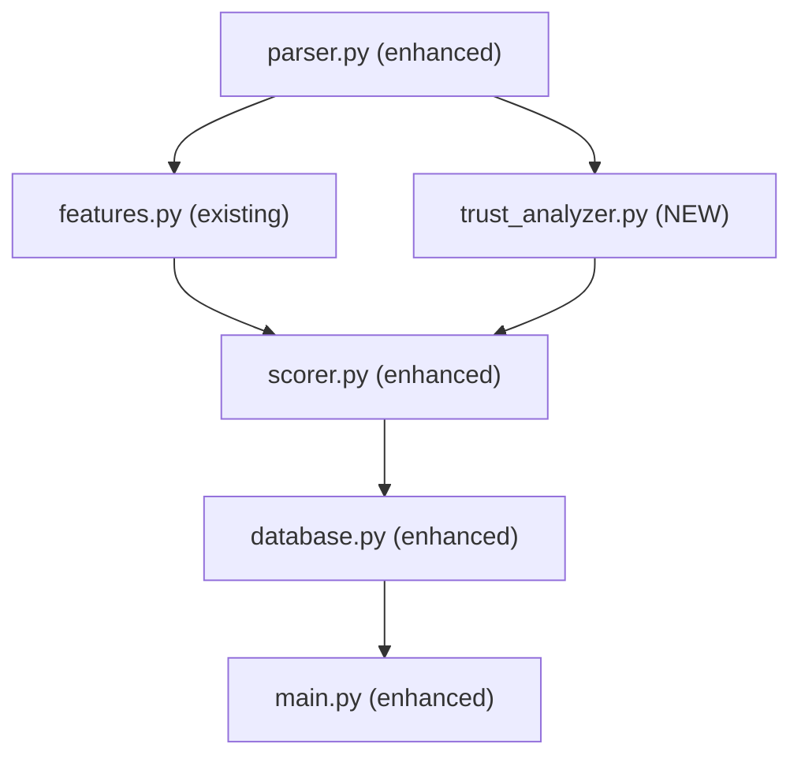

# Email Trust Analysis — Implementation Plan

## STEP 1: Current Implementation Analysis

### File-by-File Evidence

---

#### [parser.py](file:///d:/Phishing%20Email/backend/parser.py)

**Currently Extracts:**
| Header | Extracted? | Line | How |
|---|---|---|---|
| `From` | ✅ | 12 | `msg.get("From", "")` |
| `Subject` | ✅ | 13 | `msg.get("Subject", "")` |
| `Reply-To` | ✅ | 14 | `msg.get("Reply-To", "")` |
| `Return-Path` | ✅ | 15 | `msg.get("Return-Path", "")` |
| `sender_domain` | ✅ | 19-20 | Splits `@` from From header |
| `DKIM-Signature` | ❌ | — | **Not extracted** |
| Display Name | ❌ | — | `From` is stored as raw string, display name not parsed separately |
| `Authentication-Results` | ❌ | — | **Not extracted** |

**Missing for this task:** DKIM-Signature header, display name parsing, Authentication-Results header.

---

#### [features.py](file:///d:/Phishing%20Email/backend/features.py)

| Check | Status | Lines | Issues |
|---|---|---|---|
| **SPF** | ⚠️ Partial | 143-154 | Only checks if `v=spf1` record exists and has `~all`/`-all`. Does NOT distinguish softfail/neutral/none. Returns "pass"/"fail" only. Bare `except:`. |
| **DMARC** | ⚠️ Partial | 156-164 | Only checks if `v=dmarc1` record exists. Does NOT extract policy (reject/quarantine/none). Returns "pass"/"fail" only. Bare `except:`. |
| **DKIM** | ❌ Missing | — | Not implemented at all. Comment on line 130 mentions "SPF, DKIM, DMARC" but DKIM is absent. |
| **Domain Age** | ⚠️ Partial | 173-202 | Uses RDAP (good). But: only 3 risk levels (high/medium/low), thresholds hardcoded, no `creation_date`/`age_years` in output, bare `except:`, synchronous `urllib.request`. |
| **Spoofing** | ⚠️ Partial | 209-239 | Checks Reply-To mismatch ✅, Return-Path mismatch ✅, brand impersonation ✅. Missing: display name spoofing, structured output. |
| **Typosquatting** | ⚠️ Partial | 246-259 | Uses `SequenceMatcher` (good). But: threshold 0.65 too low → false positives, only checks `KNOWN_BRANDS` list, doesn't handle character substitution (0→o, I→l). |
| **Display Name Spoofing** | ❌ Missing | — | Not implemented. |
| **Trust Score** | ❌ Missing | — | Only a "threat score" (higher = worse) exists in `scorer.py`. No inverted trust score (higher = better). |
| **Sender Reputation Signals** | ❌ Missing | — | No reputation analysis. |

---

#### [scorer.py](file:///d:/Phishing%20Email/backend/scorer.py)

**Current System:** Threat Score (0–100, higher = worse)

| Signal | Weight | Issue |
|---|---|---|
| AI probability | 40 | ✅ Good |
| Domain age | 20 | ✅ Good |
| SPF fail | 10 | ✅ Good |
| DMARC fail | 10 | ✅ Good |
| Suspicious URL | 10 | ✅ Good |
| Typosquatting | 10 | ✅ Good |
| Attachment risk | 5 | ✅ Good |
| Spoofing | 5 | ✅ Good |
| **TOTAL** | **110** | 🔴 **Bug: Comment says 100, actual sum is 110** |

**Missing:** DKIM signal, display name spoofing signal, trust score concept.

---

#### [database.py](file:///d:/Phishing%20Email/backend/database.py)

**Current `scan_results` columns (14 total):**

| Column | Exists | Stores |
|---|---|---|
| `spf` | ✅ | "pass"/"fail"/"none" |
| `dmarc` | ✅ | "pass"/"fail"/"none" |
| `dkim_status` | ❌ | Not in schema |
| `trust_score` | ❌ | Not in schema |
| `domain_age_days` | ❌ | Not in schema |
| `spoofing_detected` | ❌ | Not in schema |
| `trust_analysis` | ❌ | Not in schema |

---

#### [main.py](file:///d:/Phishing%20Email/backend/main.py)

**Current `ScanResult` response model (line 31-45):**
- Returns flat fields: `spf`, `dmarc`, `risk_score`, `risk_level`
- No nested trust analysis objects
- No `trust_score` field
- `response_model=ScanResult` on `scan_text` causes 500 error on empty input (existing bug)

---

#### [model.py](file:///d:/Phishing%20Email/backend/model.py)

✅ **No changes needed.** The DistilBERT model works correctly and returns `[prob_legit, prob_phishing]`. This will feed into the trust score as-is.

---

### Summary: What's Needed vs. What Exists

| Requirement | Status | Action Required |
|---|---|---|
| 1. Domain Age | ⚠️ Partial | **Enhance** — Add creation_date, age_years, configurable thresholds, WHOIS fallback |
| 2. SPF Analysis | ⚠️ Partial | **Enhance** — Parse full SPF syntax, distinguish pass/fail/softfail/neutral/none |
| 3. DKIM Analysis | ❌ Missing | **New** — Extract DKIM-Signature header, validate via DNS, new dependency needed |
| 4. DMARC Analysis | ⚠️ Partial | **Enhance** — Extract policy (reject/quarantine/none), alignment, enforcement |
| 5. Email Spoofing | ⚠️ Partial | **Enhance** — Structured output, add From/Sender header comparison |
| 6. Display Name Spoofing | ❌ Missing | **New** — Parse display name from From header, compare to email domain |
| 7. Reply-To Mismatch | ✅ Exists | **Keep** — Already in `check_spoofing()` line 214 |
| 8. Sender Reputation | ❌ Missing | **New** — Free email provider detection, disposable domain detection |
| 9. Typosquatting | ⚠️ Partial | **Enhance** — Character substitution awareness, better thresholds |
| 10. Trust Score | ❌ Missing | **New** — Inverted score (100=safe), proper weight system summing to exactly 100 |

---

## Proposed Architecture

### Approach: New `trust_analyzer.py` Module

Rather than heavily rewriting `features.py` and `scorer.py` (which would risk breaking the existing working pipeline), I propose creating a **new dedicated module** that the pipeline calls in addition to the existing feature extraction.



### Why a New Module?
1. **Doesn't break existing code** — `features.py` continues to work as-is
2. **Separation of concerns** — Trust analysis is a distinct security domain
3. **Configurable** — Thresholds in one place, not scattered across files
4. **Testable** — Can be tested independently

---

## Files Requiring Modification

| File | Change Type | Description |
|---|---|---|
| [parser.py](file:///d:/Phishing%20Email/backend/parser.py) | **Modify** | Add extraction of: `DKIM-Signature`, `Authentication-Results`, display name from `From` header |
| **trust_analyzer.py** | **NEW** | All enhanced checks: Domain Age, SPF, DKIM, DMARC, Spoofing, Display Name Spoofing, Typosquatting, Sender Reputation, Trust Score |
| [scorer.py](file:///d:/Phishing%20Email/backend/scorer.py) | **Modify** | Fix weight sum bug (110→100), integrate DKIM + display name signals, add trust score computation |
| [database.py](file:///d:/Phishing%20Email/backend/database.py) | **Modify** | Add new columns: `trust_score`, `dkim_status`, `domain_age_days`, `spoofing_detected`, `trust_analysis` (JSON) |
| [main.py](file:///d:/Phishing%20Email/backend/main.py) | **Modify** | Update `ScanResult` model, update `run_pipeline()`, fix error handling bug |

---

## STEP 2-5: Enhanced Security Checks — Detailed Design

### Domain Age (Enhanced)

**What changes:** Replace current `check_domain_age()` with richer version.

```python
# Output format:
{
    "domain": "paypal.com",
    "creation_date": "1998-11-15",      # NEW
    "age_days": 10000,
    "age_years": 27,                     # NEW
    "risk_level": "TRUSTED"              # Enhanced: 5 levels instead of 3
}
```

**Configurable Thresholds (not hardcoded):**
```python
DOMAIN_AGE_THRESHOLDS = {
    "HIGH":        30,    # < 30 days
    "MEDIUM":      90,    # < 90 days
    "LOW_MEDIUM": 180,    # < 180 days
    "SAFE":       365,    # < 365 days
    "TRUSTED":    1095,   # > 3 years (365*3)
}
```

**Method:** Keep RDAP as primary (already working). Add `python-whois` as fallback for domains where RDAP returns no events.

---

### SPF Analysis (Enhanced)

**What changes:** Replace basic "pass"/"fail" with full SPF result parsing.

**Current logic (line 148-152):**
```python
# CURRENT (insufficient):
if "v=spf1" in txt:
    if "~all" in txt or "-all" in txt:
        results["spf"] = "pass"    # Wrong: ~all is softfail, not pass
```

> [!WARNING]
> **Current SPF logic is incorrect.** `~all` means SPF **softfail** (the domain says "probably not authorized"), but the code reports it as "pass". This must be fixed.

**Proposed logic:**
```python
# SPF mechanism analysis:
# "-all"  → fail (hard fail, unauthorized senders rejected)
# "~all"  → softfail (unauthorized senders marked, not rejected)  
# "?all"  → neutral (domain makes no assertion)
# "+all"  → pass (anyone can send — dangerous, very rare)
# No record → none

# Output:
{
    "spf_exists": True,
    "spf_record": "v=spf1 include:_spf.google.com ~all",
    "spf_mechanism": "softfail",       # pass/fail/softfail/neutral/none
    "spf_result": "softfail",
    "risk": "MEDIUM"
}
```

**SPF Risk Mapping:**
| SPF Result | Risk |
|---|---|
| Record with `-all` | LOW (strict policy) |
| Record with `~all` | MEDIUM (soft policy) |
| Record with `?all` | HIGH (no assertion) |
| Record with `+all` | CRITICAL (anyone can send) |
| No SPF record | HIGH |

---

### DKIM Analysis (New)

> [!IMPORTANT]
> **DKIM Feasibility Assessment:**
> Full DKIM *cryptographic* verification requires the original email bytes exactly as received by the mail server (headers + body with exact line endings). When a user pastes/uploads email text, the content is typically modified (line endings, whitespace, header reordering), which invalidates the DKIM signature. **Full DKIM verification is NOT reliably feasible** for text-pasted emails.

**What IS feasible and honest:**
1. ✅ **Detect if DKIM-Signature header exists** in the raw email
2. ✅ **Extract DKIM selector and signing domain** from the header (`s=` and `d=` fields)
3. ✅ **Verify that the DKIM public key exists** in DNS (`selector._domainkey.domain`)
4. ✅ **Check if signing domain matches sender domain** (alignment)
5. ✅ **Parse `Authentication-Results` header** if present (mail servers embed their DKIM verification result here)
6. ❌ **Cannot reliably verify the cryptographic signature** from pasted text

**Output:**
```python
{
    "dkim_present": True,
    "dkim_selector": "s1",
    "dkim_signing_domain": "paypal.com",
    "dkim_public_key_exists": True,
    "dkim_aligned": True,           # signing domain matches sender domain
    "dkim_auth_result": "pass",     # from Authentication-Results header, if available
    "risk": "LOW"
}
```

**New Dependency Required:** `dkimpy` (for DKIM header parsing). However, since we're only parsing the header structure (not doing cryptographic verification), we can parse the DKIM-Signature header manually with regex — **no new dependency needed for this approach**.

---

### DMARC Analysis (Enhanced)

**What changes:** Extract full DMARC policy details instead of just existence.

**Current logic (line 161):** Only checks `"v=dmarc1" in record` → "pass"/"fail"

**Proposed output:**
```python
{
    "dmarc_exists": True,
    "dmarc_record": "v=DMARC1; p=reject; rua=mailto:...",
    "policy": "reject",           # reject/quarantine/none
    "subdomain_policy": "none",   # sp= tag
    "pct": 100,                   # pct= tag (percentage enforcement)
    "risk": "LOW"
}
```

**DMARC Risk Mapping:**
| Policy | Risk |
|---|---|
| `p=reject` | LOW (strictest) |
| `p=quarantine` | MEDIUM |
| `p=none` | HIGH (monitoring only, no enforcement) |
| No DMARC record | HIGH |

---

## STEP 6-8: Spoofing, Display Name, Typosquatting

### Email Spoofing Detection (Enhanced)

**Keep existing checks**, add structured output:

```python
{
    "spoofing_detected": True,
    "checks": {
        "reply_to_mismatch": True,
        "return_path_mismatch": False,
        "from_sender_mismatch": False,    # NEW: From vs Sender header
        "brand_impersonation": "paypal",
        "display_name_spoofing": True      # NEW
    },
    "reasons": ["Reply-To domain (gmail.com) differs from sender domain (paypal.com)"]
}
```

### Display Name Spoofing (New)

**Parser change needed:** Extract display name from `From` header.

```
From: PayPal Security Team <attacker@gmail.com>
      ^^^^^^^^^^^^^^^^^^^^^^ display name
                              ^^^^^^^^^^^^^^^^^^^ actual email
```

**Detection logic:**
1. Parse display name from `From` header using `email.utils.parseaddr()`
2. Check if display name contains a known brand but email domain doesn't match
3. Check if display name looks like an email address (e.g., `"ceo@company.com" <attacker@evil.com>`)

### Typosquatting Detection (Enhanced)

**Current issue:** Threshold `0.65` is too low. `"goo"` matches `"google"` at 0.67 ratio.

**Proposed improvements:**
1. Raise threshold to `0.75` for general matching
2. Add **character substitution detection** — explicit patterns:
   - `0` → `o` (micr0soft)
   - `l` → `1` (paypa1)
   - `I` → `l` (PayPaI)
   - `rn` → `m` (payrnent)
3. Add **homoglyph detection** for common swaps
4. Apply substitution normalization before comparison
5. Scale threshold by string length (shorter strings need higher ratio)

---

## STEP 9: Trust Score System

### Weight Breakdown (Total = 100)

| Signal | Weight | Rationale |
|---|---|---|
| AI Model Prediction | 30 | Strong signal from DistilBERT, but not infallible |
| Domain Age | 15 | New domains are strongly correlated with phishing campaigns |
| SPF | 10 | Core email authentication — sender authorization |
| DKIM | 10 | Proves email integrity and sender identity |
| DMARC | 10 | Policy enforcement combining SPF + DKIM alignment |
| Spoofing Indicators | 10 | Header mismatches are strong phishing signals |
| Display Name Spoofing | 5 | Common social engineering technique |
| Typosquatting | 5 | Direct brand impersonation signal |
| Suspicious URLs | 3 | URL heuristics support but aren't definitive |
| Attachment Risk | 2 | Extension-based heuristics, lowest confidence |
| **TOTAL** | **100** | ✅ Exactly 100 |

### Trust Score Formula

```
trust_score = 100 - threat_deductions
```

Each signal deducts from 100 based on its weight. A clean email with no red flags scores 100. Each failed check subtracts its weight.

**Risk Levels (Trust Score → Level):**

| Trust Score Range | Level |
|---|---|
| 80–100 | TRUSTED |
| 60–79 | SAFE |
| 40–59 | SUSPICIOUS |
| 20–39 | DANGEROUS |
| 0–19 | CRITICAL THREAT |

---

## STEP 10: Database Changes

### New Columns Required

| Column | Type | Purpose | Impact |
|---|---|---|---|
| `trust_score` | `Integer` | 0-100 trust score | New field in save/retrieve |
| `dkim_status` | `String` | "present"/"missing"/"aligned" | New field in save/retrieve |
| `domain_age_days` | `Integer` | Actual domain age in days | New field in save/retrieve |
| `spoofing_detected` | `Integer` | 1/0 boolean | New field in save/retrieve |
| `trust_analysis` | `Text` | Full JSON trust analysis blob | Stores the complete nested analysis |

### Migration Strategy

Since this is a **SQLite database** with no migration framework (no Alembic), and there are only **5 existing records**:

**Approach:** Delete and recreate the database.
- Back up `phishing.db` → `phishing.db.backup`
- `init_db()` will create the new schema automatically via `Base.metadata.create_all()`
- This is acceptable because: only 5 records, development/student project, no production data

> [!IMPORTANT]
> **5 existing records will be lost.** If you need to preserve them, I can write a migration script to add columns via `ALTER TABLE` instead. Please confirm your preference.

---

## STEP 11: API Response Changes

### New `ScanResult` Response Model

```python
class TrustAnalysis(BaseModel):
    trust_score:     int
    risk_level:      str
    domain_age:      dict
    spf:             dict
    dkim:            dict
    dmarc:           dict
    spoofing:        dict
    typosquatting:   dict

class ScanResult(BaseModel):
    scan_id:              int
    is_phishing:          bool
    phishing_probability: float
    risk_score:           int
    risk_level:           str
    trust_score:          int          # NEW
    trust_analysis:       TrustAnalysis # NEW — nested object
    flags:                list
    sender:               str
    subject:              str
    sender_domain:        str
    url_count:            int
    attachment_count:     int
    attachment_risk:      str
    spf:                  str          # kept for backward compat
    dmarc:                str          # kept for backward compat
```

**Backward compatibility:** The existing flat fields (`spf`, `dmarc`, `risk_score`, etc.) remain. New data is added via `trust_score` and `trust_analysis`.

---

## STEP 12: Performance Recommendations

| Current Problem | Evidence | Recommendation |
|---|---|---|
| Synchronous DNS queries block event loop | `dns.resolver.resolve()` at lines 145, 159 with 5s timeout | Use `asyncio` + `dns.asyncresolver` (built into `dnspython` already installed) |
| Synchronous RDAP HTTP call | `urllib.request.urlopen()` at line 181 with 5s timeout | Use `httpx` (already installed in venv but unused) for async HTTP |
| No DNS result caching | Same domain queried 3x (SPF, DMARC, domain age) | Add `functools.lru_cache` or simple dict cache per-request |

**Recommendation for this task:** Keep synchronous for now (matching existing architecture) but add a per-request cache so each DNS query runs at most once. Converting to async would require changing the entire pipeline and is a separate refactor.

---

## STEP 13: Testing Plan

### Test Cases

| # | Test Case | Input | Expected Outcome |
|---|---|---|---|
| 1 | **Legitimate email** (gmail.com) | From: user@gmail.com, normal body | Trust score > 70, SPF pass, DMARC pass |
| 2 | **New domain phishing** | From: alert@newdomain.xyz (registered < 30 days) | Domain age = HIGH risk, trust score < 40 |
| 3 | **SPF fail** | From: user@domain-with-no-spf.xyz | SPF none/fail, trust score deducted |
| 4 | **DKIM missing** | Email without DKIM-Signature header | DKIM = missing, trust score deducted |
| 5 | **DMARC fail** | From: user@domain-without-dmarc.xyz | DMARC none, trust score deducted |
| 6 | **Spoofed sender** | From: paypal.com, Reply-To: evil@gmail.com | Spoofing detected, trust score deducted |
| 7 | **Display name spoof** | From: "PayPal Security" <attacker@gmail.com> | Display name spoofing detected |
| 8 | **Typosquatting** | From: support@paypa1.com | Typosquatting detected for "paypal" |

### Test Implementation
Tests will be written using `pytest` with proper assertions (not `print`-based manual tests). DNS/HTTP calls will be mocked using `unittest.mock.patch`.

---

## Dependencies Required

| Package | Purpose | Currently Installed? |
|---|---|---|
| `dnspython` | DNS queries (SPF, DKIM, DMARC) | ✅ Yes (v2.8.0) |
| `httpx` | Async HTTP for RDAP/WHOIS | ✅ Yes (v0.28.1, unused) |
| `python-whois` | WHOIS fallback for domain age | ❌ **Needs install** |
| All others | Existing | ✅ Yes |

> [!NOTE]
> Only **one new package** needs to be installed: `python-whois`. Everything else is already available.

---

## Risks

| Risk | Mitigation |
|---|---|
| DNS queries may timeout on slow networks | Keep 5s timeout, cache results, add graceful degradation |
| RDAP/WHOIS may not return data for some TLDs | Return "unknown" risk, don't crash |
| DKIM verification is not possible from pasted text | Clearly document limitation, check header presence + DNS key only |
| Database schema change loses 5 existing records | Offer backup option (see Step 10) |
| False positives from brand impersonation | "bank" is too generic — consider removing from KNOWN_BRANDS or requiring email body context |

---

## Awaiting Approval

Before I write any code, please confirm:

1. ✅ or ❌ — **Create `trust_analyzer.py` as a new module** (vs. rewriting `features.py`)
2. ✅ or ❌ — **Delete and recreate `phishing.db`** (5 records will be lost) vs. ALTER TABLE migration
3. ✅ or ❌ — **Install `python-whois`** as WHOIS fallback for domain age
4. ✅ or ❌ — **Keep synchronous architecture** (with caching) vs. convert to async
5. ✅ or ❌ — **Trust score weights** as proposed (AI=30, Domain=15, SPF=10, DKIM=10, DMARC=10, Spoofing=10, Display=5, Typo=5, URL=3, Attachment=2)
6. ✅ or ❌ — **DKIM approach:** Header presence + DNS key check + Authentication-Results parsing (no cryptographic verification — see feasibility note)
